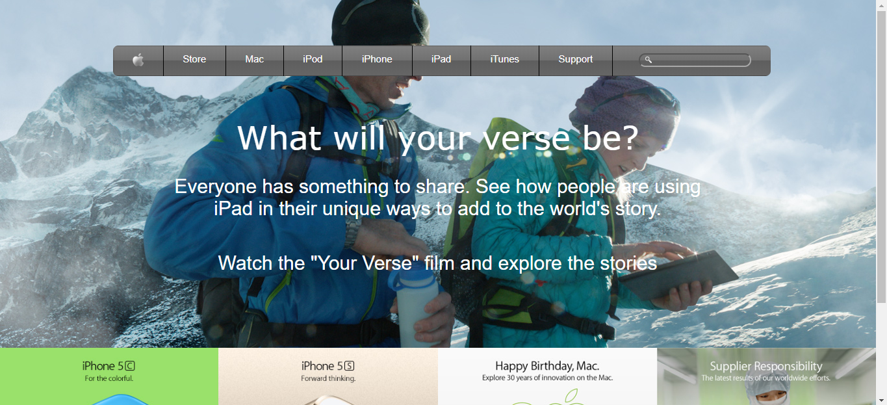

# Building with backgrounds and gradients

This project consists of building a webpage using images as a background and adding gradients to elements. The goal is to make a clone of old an old version of the Apple website webpage.  You can find the original project specification [here](https://www.theodinproject.com/courses/html5-and-css3/lessons/building-with-backgrounds-and-gradients).

## Built With

- HTML5
- CSS3
- Atom text editor

## Live Demo

[Live Demo Link](https://rawcdn.githack.com/voscarmv/building_with_backgrounds_and_gradients/f8e6a73aa5749dc993e43f146710c95dee2c1ebf/index.html)

## Author

👤 **Oscar Mier**

- Github: [@voscarmv](https://github.com/voscarmv)
- Twitter: [@voscarmv](https://twitter.com/voscarmv)
- Linkedin: [linkedin](https://www.linkedin.com/in/oscar-mier-072984196/)

## 🤝 Contributing

Contributions, issues and feature requests are welcome!

Feel free to check the [issues page](./issues/).

## Show your support

Give a ⭐️ if you like this project!

## Acknowledgments

- Hat tip to anyone whose code was used!
- Thanks to Apple for letting us clone it's page!

## 📝 License

This project is [MIT](https://opensource.org/licenses/MIT) licensed.
